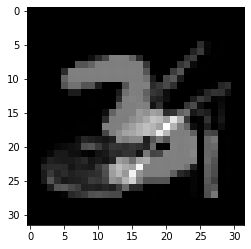
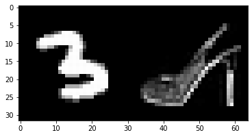

# Blind Source Separation

The purpose of the project is to separate an image obtained as a sum of a two images into its components.
The two images img1 and img2 summed together come from different dataset: mnist and fashion_mnist, respectively.
No preprocessing is allowed. The network takes in input the sum img1+img2 and returns the predicted components hat_img1 and hat_img2.
The metric used to evaluate the project is the mean squared error between predicted and ground truth images.

### Visual explanatation of the task
On the left, the input mixed signal, while we want to train a deep neural network that can separate the signals as on the right.

### Future improvements
The use of an attention mechanism (layers) could improve the performances of the model.
